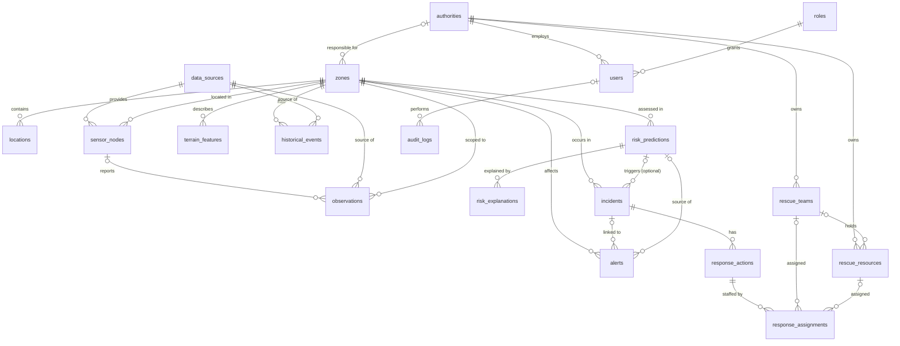

# PRAVAAH — DATABASE SPEC FOR ANTIGRAVITY

Source: the six PRAVAAH documents (PRD, App Flow, UI/UX Brief, TDD, Backend Schema, Implementation Plan) plus README. These are compact working drafts, not official SIH documents.

**Legend**
- **NOT SPECIFIED** = the source documents do not define it. Where a default is applied so work can proceed, it is labelled **APPLIED DEFAULT** and must be confirmed by the team.
- `NN` = NOT NULL. `TS` = `timestamptz`.
- `L` = `('LOW','MODERATE','HIGH','CRITICAL')` (APPLIED DEFAULT).
- `O` = `('REAL','SIMULATED','REPLAYED')`.
- This file contains no application code. Antigravity writes the migrations.

---

## 1. FINAL DATABASE ARCHITECTURE

- PostgreSQL is the system of record. PostGIS provides all spatial types and queries.
- Data flow: Frontend → FastAPI backend → services/risk engine → PostgreSQL/PostGIS. The frontend never connects to the database and never calculates risk.
- Versions: PostgreSQL 15+ and PostGIS 3.3+ (NOT SPECIFIED; APPLIED DEFAULT).
- Not used: TimescaleDB, Redis, MongoDB, raster/DEM storage, pgRouting, media storage (PRD non-goal). None is required by the documents.
- Single database, `public` schema.
- PK type: `bigint GENERATED ALWAYS AS IDENTITY`.
- Timestamps: all `timestamptz`, stored UTC, displayed in IST by clients.
- Controlled values: `varchar + CHECK` (not native enums).
- SRID: 4326 for every geometry (NOT SPECIFIED; APPLIED DEFAULT).
- JSONB: used only in `audit_logs.metadata`.
- Deletes: no hard deletes in the prototype. FKs default to `ON DELETE RESTRICT` unless stated in section 4.
- `updated_at`: maintained by trigger or ORM (NOT SPECIFIED).
- Migration/ORM tooling: NOT SPECIFIED. Alembic + SQLAlchemy 2 + GeoAlchemy2 is the recommended default.

**Reconciliation decisions already made (do not revisit):**
1. `rainfall_observations`, `water_observations` and `iot_telemetry` are merged into one `observations` table.
2. `flood_events` and `landslide_events` are merged into `historical_events` with a `hazard_type` column.
3. `zones.authority_id` is added because the baseline has no Authority→Zone link.
4. `response_assignments` replaces assignment references on `response_actions` and `rescue_resources`.
5. `data_origin` (REAL/SIMULATED/REPLAYED) is added for provenance.
6. `risk_predictions` gains per-hazard levels and `recommended_action`.

---

## 2. FINAL APPROVED TABLE LIST (19)

| Table | Group | Priority |
|---|---|---|
| roles, authorities, users | Identity | P0 |
| zones, locations | Geography | P0 |
| data_sources, sensor_nodes | Sensing | P0 |
| observations | Time-series | P0 |
| terrain_features | Terrain | P0 |
| historical_events | History | P1 |
| risk_predictions, risk_explanations | Risk | P0 |
| incidents, alerts | Operations | P0 |
| response_actions | Operations | P0 |
| rescue_teams, rescue_resources, response_assignments | Rescue | P1 |
| audit_logs | Audit | P1 |

All 19 tables are created in the migrations. Priority only governs seed and verification effort.

**Not created** (not supported by the documents): `rainfall_observations`, `water_observations`, `iot_telemetry`, `flood_events`, `landslide_events`, `alert_deliveries`, `simulation_runs`, model registry, permission/session tables, media tables, zone hierarchy.

---

## 3. COLUMNS + POSTGRESQL TYPES

Every table has `id bigint PK identity` and `created_at TS NN default now()`. Exceptions:
- `observations` has `ingested_at` instead of `created_at`.
- `response_assignments` uses `assigned_at` instead of `created_at`.

`updated_at TS NN default now()` is present only where marked (u).

```
roles
  name varchar(50) NN
  description text
  permissions text[] NN default '{}'

authorities (u)
  name varchar(150) NN
  authority_type varchar(50) NN
  region_scope text
  status varchar(20) NN default 'ACTIVE'

users (u)
  name varchar(120) NN
  email varchar(255) NN
  password_hash text NN
  role_id bigint NN
  authority_id bigint NULL
  status varchar(20) NN default 'ACTIVE'

zones (u)
  authority_id bigint NULL
  name varchar(150) NN
  zone_type varchar(50) NN
  admin_code varchar(50) NULL
  geom geometry(MultiPolygon,4326) NN
  status varchar(20) NN default 'ACTIVE'

locations (u)
  zone_id bigint NN
  name varchar(150) NN
  location_type varchar(50) NN
  admin_code varchar(50) NULL
  geom geometry(Point,4326) NN

data_sources
  name varchar(150) NN
  source_type varchar(30) NN
  provider varchar(150)
  description text
  data_origin varchar(10) NN
  status varchar(20) NN default 'ACTIVE'
  stale_after_minutes integer NULL
  provenance_notes text

sensor_nodes (u)
  node_id varchar(64) NN            -- e.g. HP-MANDI-001
  data_source_id bigint NN
  zone_id bigint NN
  location_id bigint NULL
  sensor_type varchar(50) NN
  geom geometry(Point,4326) NN
  data_origin varchar(10) NN
  status varchar(20) NN default 'ACTIVE'
  last_seen_at TS NULL

observations   (no created_at)
  sensor_node_id bigint NULL
  data_source_id bigint NN
  zone_id bigint NN
  location_id bigint NULL
  observed_at TS NN
  ingested_at TS NN default now()
  rainfall_1h_mm numeric(7,2) NULL
  soil_moisture_pct numeric(5,2) NULL
  water_level_m numeric(7,3) NULL
  water_level_rate_m_per_h numeric(7,3) NULL     -- derived by ingestion, NULL if not computed
  slope_angle_deg numeric(5,2) NULL
  temperature_c numeric(5,2) NULL
  humidity_pct numeric(5,2) NULL
  quality_status varchar(10) NN default 'VALID'
  data_origin varchar(10) NN

terrain_features (u)
  zone_id bigint NN
  location_id bigint NULL
  elevation_m numeric(7,2) NULL
  slope_deg numeric(5,2) NULL
  susceptibility_score numeric(4,3) NULL         -- scale NOT SPECIFIED; APPLIED DEFAULT 0..1
  data_source_id bigint NN
  data_origin varchar(10) NN

historical_events
  hazard_type varchar(10) NN
  zone_id bigint NN
  location_id bigint NULL
  event_time TS NN
  severity varchar(10) NULL
  description text
  affected_area geometry(MultiPolygon,4326) NULL
  data_source_id bigint NN
  data_origin varchar(10) NN

risk_predictions
  zone_id bigint NN
  location_id bigint NULL
  predicted_at TS NN
  horizon_minutes integer NN
  flood_probability numeric(5,4) NULL
  landslide_probability numeric(5,4) NULL
  flood_risk_level varchar(10) NULL
  landslide_risk_level varchar(10) NULL
  overall_risk_level varchar(10) NN
  confidence numeric(5,4) NULL
  model_name varchar(100) NN
  model_version varchar(50) NN
  recommended_action text NULL
  input_data_as_of TS NULL
  data_origin varchar(10) NN
  status varchar(12) NN default 'ACTIVE'

risk_explanations
  risk_prediction_id bigint NN
  factor_name varchar(100) NN
  factor_value numeric(12,4) NULL
  unit varchar(20) NULL
  contribution numeric(6,4) NULL                 -- semantics NOT SPECIFIED; APPLIED DEFAULT relative importance 0..1
  explanation_text text NN
  display_order smallint NN default 1

incidents (u)
  zone_id bigint NN
  location_id bigint NULL
  geom geometry(Point,4326) NULL
  incident_type varchar(10) NN
  severity varchar(10) NN
  status varchar(15) NN default 'OPEN'
  description text
  source_prediction_id bigint NULL
  started_at TS NN
  resolved_at TS NULL
  created_by bigint NULL
  data_origin varchar(10) NN

alerts (u)
  zone_id bigint NN
  location_id bigint NULL
  alert_type varchar(10) NN
  severity varchar(10) NN
  message text NN
  incident_id bigint NULL
  source_prediction_id bigint NULL
  status varchar(15) NN default 'ACTIVE'
  issued_at TS NN default now()
  expires_at TS NULL
  issued_by bigint NULL
  acknowledged_at TS NULL
  acknowledged_by bigint NULL
  data_origin varchar(10) NN

response_actions (u)
  incident_id bigint NN
  action_type varchar(50) NN
  status varchar(15) NN default 'PLANNED'
  priority varchar(10) NN
  started_at TS NULL
  completed_at TS NULL
  notes text
  created_by bigint NULL

rescue_teams (u)
  authority_id bigint NN
  name varchar(150) NN
  team_type varchar(50) NN
  status varchar(15) NN default 'AVAILABLE'
  geom geometry(Point,4326) NULL

rescue_resources (u)
  authority_id bigint NN
  team_id bigint NULL
  resource_type varchar(50) NN
  name varchar(150) NN
  quantity integer NN default 1
  status varchar(15) NN default 'AVAILABLE'
  geom geometry(Point,4326) NULL

response_assignments   (no created_at)
  response_action_id bigint NN
  team_id bigint NULL
  resource_id bigint NULL
  status varchar(10) NN default 'ASSIGNED'
  assigned_at TS NN default now()
  released_at TS NULL
  assigned_by bigint NULL

audit_logs
  user_id bigint NULL
  action varchar(50) NN
  entity_type varchar(50) NN
  entity_id bigint NULL
  metadata jsonb NULL
```

---

## 4. PK / FK RELATIONSHIPS

All PKs are `id`. `ON DELETE` is RESTRICT unless stated.

| Child.column | → Parent | Null | On delete |
|---|---|---|---|
| users.role_id | roles | NN | – |
| users.authority_id | authorities | NULL | – |
| zones.authority_id | authorities | NULL | – |
| locations.zone_id | zones | NN | – |
| sensor_nodes.data_source_id / zone_id | data_sources / zones | NN | – |
| sensor_nodes.location_id | locations | NULL | – |
| observations.sensor_node_id | sensor_nodes | NULL | – |
| observations.data_source_id / zone_id | data_sources / zones | NN | – |
| observations.location_id | locations | NULL | – |
| terrain_features.zone_id / data_source_id | zones / data_sources | NN | – |
| terrain_features.location_id | locations | NULL | – |
| historical_events.zone_id / data_source_id | zones / data_sources | NN | – |
| historical_events.location_id | locations | NULL | – |
| risk_predictions.zone_id | zones | NN | – |
| risk_predictions.location_id | locations | NULL | – |
| risk_explanations.risk_prediction_id | risk_predictions | NN | CASCADE |
| incidents.zone_id | zones | NN | – |
| incidents.location_id | locations | NULL | – |
| incidents.source_prediction_id | risk_predictions | NULL | SET NULL |
| incidents.created_by | users | NULL | – |
| alerts.zone_id | zones | NN | – |
| alerts.location_id | locations | NULL | – |
| alerts.incident_id | incidents | NULL | – |
| alerts.source_prediction_id | risk_predictions | NULL | – |
| alerts.issued_by / acknowledged_by | users | NULL | – |
| response_actions.incident_id | incidents | NN | – |
| response_actions.created_by | users | NULL | – |
| rescue_teams.authority_id | authorities | NN | – |
| rescue_resources.authority_id | authorities | NN | – |
| rescue_resources.team_id | rescue_teams | NULL | – |
| response_assignments.response_action_id | response_actions | NN | CASCADE |
| response_assignments.team_id | rescue_teams | NULL | – |
| response_assignments.resource_id | rescue_resources | NULL | – |
| response_assignments.assigned_by | users | NULL | – |
| audit_logs.user_id | users | NULL | – |



---

## 5. CONSTRAINTS

**Controlled values (CHECK):**

| Column(s) | Allowed values |
|---|---|
| `data_origin` (all tables that have it) | O |
| any `*_risk_level`, `severity`, `response_actions.priority` | L |
| authorities.status, zones.status, data_sources.status | ACTIVE, INACTIVE |
| users.status | ACTIVE, DISABLED |
| data_sources.source_type | IOT_TELEMETRY, EXTERNAL_DATASET, HISTORICAL_RECORD (APPLIED DEFAULT) |
| sensor_nodes.status | ACTIVE, INACTIVE, MAINTENANCE |
| observations.quality_status | VALID, SUSPECT, INVALID |
| historical_events.hazard_type | FLOOD, LANDSLIDE |
| risk_predictions.status | ACTIVE, SUPERSEDED |
| incidents.incident_type, alerts.alert_type | FLOOD, LANDSLIDE, OTHER (APPLIED DEFAULT) |
| incidents.status | OPEN, IN_PROGRESS, RESOLVED |
| alerts.status | ACTIVE, ACKNOWLEDGED, CANCELLED |
| response_actions.status | PLANNED, IN_PROGRESS, COMPLETED, CANCELLED |
| rescue_teams.status, rescue_resources.status | AVAILABLE, DEPLOYED, UNAVAILABLE |
| response_assignments.status | ASSIGNED, DEPLOYED, RELEASED |

**Uniqueness:**
- `roles.name`
- `authorities.name`
- `users`: `lower(email)`
- `data_sources.name`
- `sensor_nodes.node_id`
- `risk_explanations`: `(risk_prediction_id, factor_name)`
- `rescue_teams`: `(authority_id, name)`
- `rescue_resources`: `(authority_id, name)`

**Range checks:**
- `soil_moisture_pct` and `humidity_pct` between 0 and 100.
- `rainfall_1h_mm >= 0`.
- `slope_angle_deg` and `slope_deg` between 0 and 90.
- `susceptibility_score`, `flood_probability`, `landslide_probability` and `confidence` between 0 and 1.
- `horizon_minutes > 0`.
- `data_sources.stale_after_minutes > 0`.
- `rescue_resources.quantity > 0`.

**Row-level rules:**
- `zones`: `ST_IsValid(geom)`.
- `data_sources`: `data_origin <> 'REAL' OR provenance_notes IS NOT NULL`.
- `observations`: at least one of the seven measurement columns is not null.
- `incidents`: `(status='RESOLVED') = (resolved_at IS NOT NULL)`, and `resolved_at >= started_at`.
- `alerts`: `expires_at > issued_at`, and `(acknowledged_at IS NULL) = (acknowledged_by IS NULL)`.
- `response_actions`: `completed_at >= started_at`.
- `response_assignments`: `num_nonnulls(team_id, resource_id) = 1`.

**Rules enforced by the backend (not by constraints):**
- A sensor's `zone_id` must match `ST_Within(sensor.geom, zone.geom)`. This is checked at registration and in seed verification.
- A prediction's `data_origin` is the least-trusted origin among its inputs (SIMULATED, then REPLAYED, then REAL).
- Team and resource `status` is kept in sync with assignments in the same transaction.

---

## 6. REQUIRED INDEXES

| Table | Index | Purpose |
|---|---|---|
| users | UNIQUE (lower(email)); (authority_id) | Login, scoping |
| zones | GiST (geom); (authority_id); UNIQUE (admin_code) WHERE admin_code IS NOT NULL | Map, scoping |
| locations | GiST (geom); (zone_id) | Map, zone lookup |
| sensor_nodes | GiST (geom); (zone_id); (data_source_id); (status) | Map, health |
| observations | UNIQUE (sensor_node_id, observed_at) WHERE sensor_node_id IS NOT NULL | Idempotent ingest; latest per sensor |
| observations | (zone_id, observed_at DESC); (data_source_id, observed_at DESC) | Zone trends, source health |
| observations | BRIN (observed_at) — optional, P2 | Large history scans |
| terrain_features | UNIQUE (zone_id) WHERE location_id IS NULL; UNIQUE (location_id) WHERE location_id IS NOT NULL | One row per zone/location |
| historical_events | (zone_id, hazard_type, event_time DESC); GiST (affected_area) WHERE affected_area IS NOT NULL | History, spatial |
| risk_predictions | (zone_id, predicted_at DESC) | Risk history |
| risk_predictions | UNIQUE (zone_id, COALESCE(location_id,0)) WHERE status='ACTIVE' | One active prediction per zone/location |
| risk_predictions | (overall_risk_level, predicted_at DESC) WHERE status='ACTIVE' | Dashboard high-risk list |
| risk_explanations | (risk_prediction_id, display_order) | Ordered factors |
| incidents | (status, severity); (zone_id, started_at DESC); (source_prediction_id); GiST (geom) WHERE geom IS NOT NULL | List, map |
| alerts | (status, severity, issued_at DESC); (zone_id, issued_at DESC); (incident_id); (source_prediction_id) | List, links |
| response_actions | (incident_id); (status) | Incident detail |
| rescue_teams / rescue_resources | (status); GiST (geom) WHERE geom IS NOT NULL | Availability, proximity |
| response_assignments | (response_action_id); UNIQUE (resource_id) WHERE status<>'RELEASED' AND resource_id IS NOT NULL; UNIQUE (team_id) WHERE status<>'RELEASED' AND team_id IS NOT NULL | One active assignment |
| audit_logs | (entity_type, entity_id, created_at DESC); (user_id, created_at DESC) | Traceability |

---

## 7. POSTGIS / SPATIAL FIELDS

| Field | Type | SRID | Kind | Index | Purpose |
|---|---|---|---|---|---|
| zones.geom | MultiPolygon | 4326 | geometry | GiST | Risk-map boundaries, containment |
| locations.geom | Point | 4326 | geometry | GiST | Villages/places |
| sensor_nodes.geom | Point | 4326 | geometry | GiST | Sensor layer |
| incidents.geom | Point, NULL | 4326 | geometry | GiST (partial) | Incident marker |
| rescue_teams.geom, rescue_resources.geom | Point, NULL | 4326 | geometry | GiST (partial) | Resource layer, proximity |
| historical_events.affected_area | MultiPolygon, NULL | 4326 | geometry | GiST (partial) | Historical footprint, if available |

Observations, predictions, alerts and terrain carry no geometry; they reach space through `zone_id`.

**Required queries:**
- Zone containing a sensor: `ST_Within(sensor.geom, zone.geom)`.
- Locations in a risk area: join `locations.zone_id` to the ACTIVE prediction, with `ST_Within` as fallback for arbitrary polygons.
- Resources near an incident: `ST_DWithin(r.geom::geography, i.geom::geography, :meters)` ordered by `ST_Distance`. No geography index (prototype scale).
- Map output: `ST_AsGeoJSON`. Simplification is optional (P2).

Not required (NOT SPECIFIED): raster/DEM, routing, topology.

---

## 8. TIME-SERIES FIELDS

| Table | Observation time | Ingestion time | Source | Measurement | Unit | Quality |
|---|---|---|---|---|---|---|
| observations | observed_at | ingested_at | sensor_node_id, data_source_id | 7 measurement columns | In column name (APPLIED DEFAULT; see section 16) | quality_status |

Other time fields: `risk_predictions.predicted_at`, `incidents.started_at`, `alerts.issued_at`, `historical_events.event_time`, `sensor_nodes.last_seen_at`.

**Rules:**
- Latest reading per sensor: lateral join on the unique `(sensor_node_id, observed_at)` index.
- `sensor_nodes.last_seen_at` is updated in the ingest transaction and only moves forward.
- Staleness is computed by the API and never stored. A sensor is stale when `now() - last_seen_at > COALESCE(data_sources.stale_after_minutes, app default)`, or when `last_seen_at IS NULL`. The threshold value is NOT SPECIFIED.
- Malformed payloads are rejected (HTTP 422) and not stored. Range failures are stored as SUSPECT or INVALID. The risk engine reads only VALID rows.
- No partitioning or retention policy (NOT SPECIFIED).

---

## 9. RISK PREDICTION + EXPLANATION SCHEMA

Tables: `risk_predictions` and `risk_explanations` (section 3).

- The backend risk engine is the only writer. The frontend never computes risk.
- Insert the new prediction as ACTIVE and set the previous ACTIVE row to SUPERSEDED in the same transaction.
- Superseded rows are kept. The dashboard's "recent changes" compares the ACTIVE row with the most recent SUPERSEDED row for the same zone.
- `valid_until = predicted_at + horizon_minutes`, derived in the API and not stored.
- `flood_*` and `landslide_*` fields are NULL where a hazard is not applicable.
- `confidence` and the probabilities stay NULL unless the engine can justify them (no unvalidated accuracy claims).
- `model_name` and `model_version` are always stored.
- `factor_name` reuses observation names (`rainfall_1h`, `soil_moisture`, `water_level`, `slope_angle`).
- Prediction horizon values are NOT SPECIFIED. Default is a single horizon per zone. If several are needed, add `horizon_minutes` to the active-unique index.

---

## 10. SENSOR / IoT SCHEMA

Tables: `data_sources`, `sensor_nodes`, `observations`.

**Telemetry contract → columns** (ingestion endpoint; TDD example):

| Payload field | Column |
|---|---|
| node_id | resolves `sensor_nodes.node_id` → `sensor_node_id`, `data_source_id`, `zone_id` |
| timestamp | observed_at |
| rainfall_1h | rainfall_1h_mm |
| soil_moisture | soil_moisture_pct |
| water_level | water_level_m |
| slope_angle | slope_angle_deg |
| temperature | temperature_c |
| humidity | humidity_pct |
| data_origin (added to the contract) | data_origin |

- Simulator and replay use the same endpoint, marked SIMULATED or REPLAYED.
- `water_level_rate_m_per_h` is computed by ingestion, not supplied by payload.
- `data_origin` is not in the TDD example payload. Adding it is an APPLIED DEFAULT.
- Telemetry `slope_angle` is stored as received. `terrain_features.slope_deg` is authoritative for the risk engine.
- `raw_payload` is omitted (NOT SPECIFIED).
- Provenance: values are REAL/SIMULATED/REPLAYED. SYNTHETIC is not defined in the documents and is not added. The UI badges any non-REAL data. Nothing SIMULATED or REPLAYED may be shown as validated real-world prediction.

---

## 11. INCIDENT / ALERT / RESPONSE SCHEMA

Tables: `incidents`, `alerts`, `response_actions`, `rescue_teams`, `rescue_resources`, `response_assignments`, `audit_logs`.

- **Incident lifecycle:** OPEN → IN_PROGRESS → RESOLVED. `resolved_at` is set exactly when status is RESOLVED.
- **Incident location:** `geom` (optional point) plus `zone_id` and optional `location_id`.
- **Alert lifecycle:** ACTIVE → ACKNOWLEDGED, or CANCELLED.
  - "Expired" is derived by the API as `effective_status` when `expires_at < now()`. It is not stored.
  - Alert cancellation behaviour is NOT SPECIFIED.
  - Alert delivery is NOT SPECIFIED, so there is no delivery table.
- **Response action lifecycle:** PLANNED → IN_PROGRESS → COMPLETED, or CANCELLED.
- **Assignments:**
  - One row assigns exactly one team or one resource to one action.
  - A team or resource has at most one non-RELEASED assignment at a time.
  - Statuses: ASSIGNED → DEPLOYED → RELEASED.
- **Team and resource status** is kept in sync with assignments in the same transaction.
- **Audit:** the backend writes `audit_logs` on alert issue/acknowledge, incident create/update, response action create/update, and assignment create/update. `metadata` is the only JSONB column.
- **Who creates incidents/alerts** (manual vs auto from predictions) and any alert approval workflow: NOT SPECIFIED. Applied default is manual creation by authorized roles.
- **Type vocabularies** for `action_type`, `team_type`, `resource_type`, `zone_type`, `location_type`, `sensor_type` and `authority_type`: NOT SPECIFIED. Free `varchar`.

---

## 12. SEED / DEMO DATA STRUCTURE

Every seeded row has `data_origin='SIMULATED'`. There are no REAL rows.

| Entity | Rows | Notes |
|---|---|---|
| roles | 3 | AUTHORITY_OFFICER, INCIDENT_COMMANDER, RESOURCE_COORDINATOR (APPLIED DEFAULT, from PRD users) |
| authorities / users | 1 / 3 | One user per role; passwords from env, never committed |
| data_sources | 3 | Telemetry Simulator (SIMULATED), Replay Feed (REPLAYED, only if replay is built), Demo Reference Data (SIMULATED) |
| zones / locations | 5 / 10 | Names prefixed "Demo"; illustrative polygons near the TDD sample region (Mandi, HP). Region itself NOT SPECIFIED |
| sensor_nodes | 6 | HP-MANDI-001…006; one deliberately stale |
| observations | ~150 | 24h hourly per sensor; one zone shows a rising rainfall/soil-moisture/water-level trend; one SUSPECT reading |
| terrain_features / historical_events | 5 / 4 | 2 flood, 2 landslide; one with `affected_area` |
| risk_predictions | 5 ACTIVE + 1 SUPERSEDED | Levels LOW–HIGH; the SUPERSEDED row shows a "recent change"; model `demo-rule-baseline` v`0.1-demo`; `confidence` NULL |
| risk_explanations | ~12 | 3–4 factors per MODERATE+ prediction |
| incidents / alerts | 2 / 2 | FLOOD/HIGH/IN_PROGRESS linked to the HIGH prediction; LANDSLIDE/RESOLVED. Alerts: one ACTIVE, one ACKNOWLEDGED |
| rescue_teams / rescue_resources | 2 / 4 | Types are free text |
| response_actions / response_assignments | 2 / 2 | One IN_PROGRESS with a team DEPLOYED; one PLANNED with a resource ASSIGNED |
| audit_logs | ~4 | Sample entries |

The escalation scenario (baseline → sensor change → higher risk → incident/alert → response) is a script outside the database. It sends telemetry through the ingestion endpoint, and the risk engine writes the new predictions.

---

## 13. FRONTEND → API → DATABASE MAPPING

| Screen | API endpoint(s) | Tables | Key fields |
|---|---|---|---|
| Login | POST /auth/login, GET /auth/me | users, roles, authorities | role, permissions, authority |
| Dashboard | GET /dashboard/summary | risk_predictions, zones, incidents, alerts, sensor_nodes, observations, rescue_teams, rescue_resources | overall_risk_level, predicted_at, horizon_minutes, severity, status, is_stale, data_origin |
| Risk Map | GET /map/features | zones, risk_predictions, incidents, sensor_nodes, rescue_* | geom, risk levels, predicted_at, marker status |
| Zone Detail | GET /zones/{id}, /zones/{id}/observations, /zones/{id}/risk-history | zones, risk_predictions, risk_explanations, terrain_features, observations, sensor_nodes, incidents, alerts, rescue_* | levels, horizon, factors, trend series |
| Risk Detail | GET /risk/predictions/{id} | risk_predictions, risk_explanations, incidents, alerts | flood/landslide level/probability/confidence, factors, model, recommended_action |
| Incidents | GET /incidents, GET /incidents/{id}, POST/PATCH /incidents | incidents, zones, locations, risk_predictions, alerts, response_actions, response_assignments | type, severity, status, times, geom |
| Alerts | GET /alerts, GET /alerts/{id}, POST /alerts, POST /alerts/{id}/acknowledge | alerts, zones, users, risk_predictions, incidents | effective_status, issued/expires/acknowledged |
| Rescue/Response | GET /response/teams, /response/resources, POST /incidents/{id}/response-actions, PATCH /response-actions/{id}, POST /response-actions/{id}/assignments, PATCH /assignments/{id} | rescue_teams, rescue_resources, response_actions, response_assignments | type, status, geom, assigned incident |
| Sensors/Data | GET /sensors, /sensors/{node_id}/readings, /data-sources | data_sources, sensor_nodes, observations | status, last_seen_at, is_stale, quality_status, data_origin |
| Simulation (optional) | POST /ingest/telemetry, GET /observations, GET /map/features (filtered by `data_origin`) | observations, risk_predictions | data_origin |

Simulation control endpoints (start/stop/scenario) are NOT SPECIFIED. There is no simulation table.

---

## 14. REQUIRED API DATA FIELDS

Base path `/api/v1` (NOT SPECIFIED; APPLIED DEFAULT). Timestamps are ISO-8601 with offset. Lists return `{items,total,limit,offset}`. Every record carries `data_origin`. Reads are scoped by the user's authority; handling of zones with NULL `authority_id` is NOT SPECIFIED.

| # | Method | Path | Request params | Response fields | Tables |
|---|---|---|---|---|---|
| 1 | POST | /auth/login | email, password | access_token, expires_in, user{id,name,role,authority} | users, roles, authorities |
| 2 | GET | /auth/me | – | user, role, permissions, authority | users, roles, authorities |
| 3 | GET | /dashboard/summary | – | risk_counts_by_level; high_risk_zones[]; recent_changes[{zone_id,previous_level,current_level,changed_at}]; active_incidents{count,by_severity,latest[]}; active_alerts{count,by_severity,latest[]}; sensor_health{active,stale,inactive}; environmental_indicators; resource_status; data_origins_present | risk_predictions, zones, incidents, alerts, sensor_nodes, observations, rescue_* |
| 4 | GET | /map/features | layers=zones,incidents,sensors,resources; bbox?; min_level? | GeoJSON per layer. Zones: zone_id, name, overall/flood/landslide level, predicted_at, horizon_minutes. Incidents: id, type, severity, status. Sensors: node_id, status, is_stale, last_seen_at. Resources: id, type, status | zones, risk_predictions, incidents, sensor_nodes, rescue_* |
| 5 | GET | /zones | status?, q? | zone_id, name, zone_type, current_risk | zones, risk_predictions |
| 6 | GET | /zones/{id} | include_geometry?, nearby_radius_m? | zone, current_risk, top_factors[], terrain, latest_observation, sensors[], active_incidents[], active_alerts[], nearby_resources[] | zones, risk_predictions, risk_explanations, terrain_features, observations, sensor_nodes, incidents, alerts, rescue_* |
| 7 | GET | /zones/{id}/observations | from, to, metrics, limit | series[{observed_at, metrics, quality_status, data_origin}] | observations |
| 8 | GET | /zones/{id}/risk-history | from, to | [{predicted_at, overall_risk_level, flood/landslide level+probability, model_version}] | risk_predictions |
| 9 | GET | /risk/predictions | zone_id?, status=ACTIVE, min_level?, limit, offset | prediction summary rows | risk_predictions, zones |
| 10 | GET | /risk/predictions/{id} | – | all prediction fields, explanations[], related_incidents[], related_alerts[] | risk_predictions, risk_explanations, incidents, alerts |
| 11 | POST | /ingest/telemetry | node_id, timestamp, rainfall_1h, soil_moisture, water_level, slope_angle, temperature, humidity, data_origin | 201 {observation_id, quality_status}; 404 unknown node; 409 duplicate; 422 invalid | sensor_nodes, observations, data_sources |
| 12 | GET | /observations | node_id?, zone_id?, from, to, quality_status?, data_origin?, limit | observation rows | observations |
| 13 | GET | /sensors | zone_id?, status?, stale? | node_id, sensor_type, zone_id, status, is_stale, last_seen_at, data_origin, geometry, latest_reading | sensor_nodes, observations, data_sources |
| 14 | GET | /sensors/{node_id}/readings | from, to, limit | sensor meta + readings[] | sensor_nodes, observations |
| 15 | GET | /data-sources | – | id, name, source_type, provider, data_origin, status, provenance_notes, last_observation_at, is_stale | data_sources, observations |
| 16 | GET | /incidents | status, severity, incident_type, zone_id, from, to, limit, offset | id, type, severity, status, zone, location, started_at, resolved_at, source_prediction_id | incidents, zones, locations |
| 17 | GET | /incidents/{id} | – | incident, zone, location/geometry, source_prediction summary, alerts[], response_actions[{…, assignments[]}] | incidents, zones, locations, risk_predictions, alerts, response_actions, response_assignments, rescue_* |
| 18 | POST | /incidents | zone_id, location_id?, lat/lon?, incident_type, severity, description, source_prediction_id?, started_at | 201 incident | incidents, audit_logs |
| 19 | PATCH | /incidents/{id} | status?, severity?, description? | incident | incidents, audit_logs |
| 20 | GET | /alerts | status, severity, zone_id, active_only | id, type, severity, effective_status, message, zone, issued_at, expires_at, acknowledged_*, incident_id, source_prediction_id | alerts, zones, users |
| 21 | GET | /alerts/{id} | – | alert + zone/location + source prediction/incident summary | alerts, zones, risk_predictions, incidents |
| 22 | POST | /alerts | zone_id, location_id?, alert_type, severity, message, incident_id?, source_prediction_id?, expires_at? | 201 alert | alerts, audit_logs |
| 23 | POST | /alerts/{id}/acknowledge | – | alert | alerts, audit_logs |
| 24 | GET | /response/teams | status?, type? | id, name, team_type, status, geometry, current_assignments[] | rescue_teams, response_assignments |
| 25 | GET | /response/resources | status?, type?, near_incident_id?, radius_m? | id, name, resource_type, quantity, status, team_id, geometry, distance_m?, assigned_incident_id? | rescue_resources, response_assignments, response_actions, incidents |
| 26 | POST | /incidents/{id}/response-actions | action_type, priority, notes? | 201 action | response_actions, audit_logs |
| 27 | PATCH | /response-actions/{id} | status?, notes?, started_at?, completed_at? | action | response_actions, audit_logs |
| 28 | POST | /response-actions/{id}/assignments | team_id xor resource_id | 201; 409 if already actively assigned | response_assignments, rescue_*, audit_logs |
| 29 | PATCH | /assignments/{id} | status (DEPLOYED/RELEASED) | assignment | response_assignments, rescue_*, audit_logs |

**P0 endpoints:** 1–4, 6, 9–11, 13, 16–17, 20–23. The rest are P1.

**NOT SPECIFIED:** risk-run trigger (the engine writes internally), alert cancellation endpoint, simulation control endpoints, refresh/logout tokens, simulator service authentication.

---

## 15. MIGRATION / IMPLEMENTATION ORDER

1. **PostgreSQL:** create the database, a least-privilege app role and `.env.example`. No credentials in the frontend.
2. **PostGIS:** `CREATE EXTENSION postgis`, then verify with `PostGIS_Version()`.
3. **Migration tooling:** versioned migrations (Alembic recommended; NOT SPECIFIED).
4. **Tables and FKs**, in this order:
   1. `roles`, `authorities`, `users`
   2. `zones`, `locations`
   3. `data_sources`, `sensor_nodes`
   4. `observations`, `terrain_features`, `historical_events`
   5. `risk_predictions`, `risk_explanations`
   6. `incidents`, `alerts`
   7. `rescue_teams`, `rescue_resources`, `response_actions`, `response_assignments`
   8. `audit_logs`
5. **Constraints** (section 5).
6. **Indexes** (section 6), including a GiST index on every geometry column.
7. **Seed data** (section 12).
8. **Verification:**
   - `geometry_columns` shows SRID 4326 and the expected geometry types.
   - All geometries are valid, and every sensor is `ST_Within` its zone.
   - Negative tests fail as expected: a bad level, two active assignments for one resource, an `observations` row with no measurement, a REAL source without provenance notes.
   - `EXPLAIN` on the latest-per-sensor and ACTIVE-prediction queries uses the intended indexes.
   - Seed row counts match section 12, and no row has NULL `data_origin`.
9. **Backend API integration:** FastAPI + SQLAlchemy 2 + GeoAlchemy2 (recommended; TDD says "preferred"). Build the P0 endpoints first. The frontend never touches the database.
10. **Deliverables:** migrations, seed script, `.env.example`, `DATABASE_SETUP.md`.

---

## 16. EXPLICIT UNRESOLVED ITEMS

Every item below is **NOT SPECIFIED IN SOURCE DOCUMENTS**. The applied default is what Antigravity should implement until the team decides.

| # | Item | Applied default |
|---|---|---|
| 1 | Risk level scale | LOW / MODERATE / HIGH / CRITICAL, reused for severity and priority |
| 2 | Telemetry units | mm, %, m, degrees, °C, %RH, encoded in column names |
| 3 | Stale threshold | `data_sources.stale_after_minutes` plus an app-level default |
| 4 | Replay timestamp policy | Replay re-stamps `observed_at` to current time and is marked REPLAYED |
| 5 | Prediction horizon(s) | Single horizon per zone |
| 6 | Whether a zone can belong to several authorities; visibility of zones with NULL `authority_id` | `zones.authority_id` nullable, single authority |
| 7 | Who creates incidents/alerts; alert approval workflow | Manual by authorized roles; no approval table |
| 8 | Alert delivery, alert cancellation | No delivery table; CANCELLED status only |
| 9 | Role and permission matrix; role names | Three roles from PRD users; `permissions text[]` enforced in the backend |
| 10 | Auth mechanism (local vs SSO) | `password_hash` |
| 11 | Type vocabularies (zone, location, sensor, authority, team, resource, action) | Free `varchar` |
| 12 | Administrative identifiers | Single nullable `admin_code` |
| 13 | Geographic region and CRS | SRID 4326; seed geometry illustrative around Mandi, HP |
| 14 | `contribution` and `susceptibility_score` semantics/scale | Numeric 0..1 |
| 15 | Incident and alert type values | FLOOD / LANDSLIDE / OTHER |
| 16 | `data_origin` in the ingest payload | Added as a field on `/ingest/telemetry` |
| 17 | SYNTHETIC provenance value | Not added |
| 18 | `raw_payload` storage | Omitted |
| 19 | Data retention and partitioning | None |
| 20 | Migration/ORM tooling; PostgreSQL/PostGIS versions | Alembic + SQLAlchemy 2 + GeoAlchemy2; PostgreSQL 15+, PostGIS 3.3+ |
| 21 | Zone Detail vs Risk Detail (separate in App Flow, combined in UI brief) | Both endpoints exist (#6, #10); the frontend may present them as one screen |
| 22 | Simulation control API and tables | None |