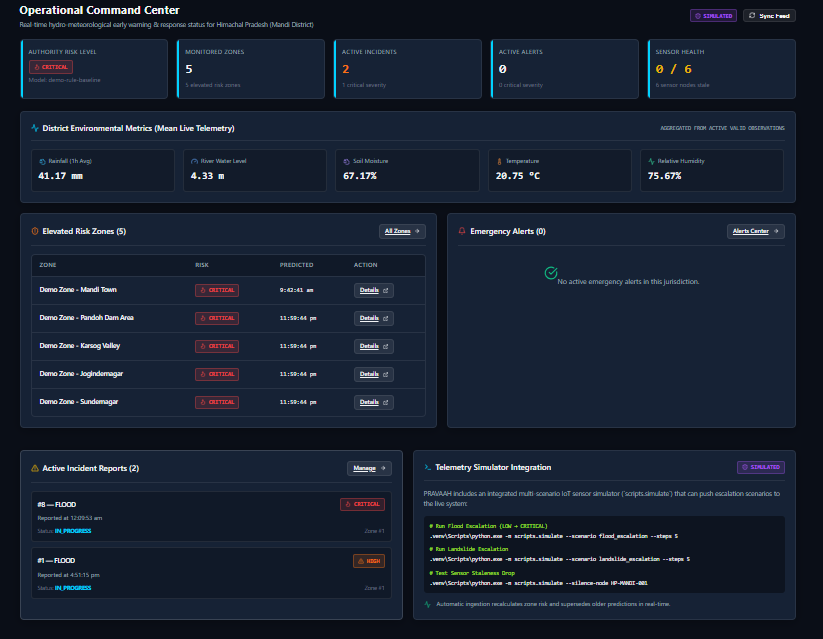

<p align="center">
  <h1 align="center">🌊 PRAVAAH</h1>
  <p align="center"><strong>Hydro-Meteorological Disaster Warning & Response System</strong></p>
  <p align="center">
    Full-stack geospatial platform for real-time flood & landslide risk monitoring, early warning, and coordinated disaster response.
  </p>
  <p align="center">
    
    
    
    
    
    
  </p>
</p>

---

## 📋 About the Project

**PRAVAAH** was developed as a **Smart India Hackathon (SIH)** project to address the critical challenge of hydro-meteorological disaster management in India.

India faces recurring floods and landslides that cause significant loss of life and property every year. Existing systems often lack real-time risk assessment, geospatial awareness, and coordinated response capabilities.

PRAVAAH addresses this by providing:

- **Real-time environmental monitoring** — Ingesting sensor telemetry (rainfall, water levels, soil moisture, temperature) from IoT sensor networks across monitored zones.
- **Automated risk assessment** — A rule-based risk engine that evaluates flood and landslide probabilities per zone using configurable thresholds, terrain data, and historical event records.
- **Multi-layer geospatial visualization** — An interactive map with 8 spatial layers (zones, incidents, sensors, rescue teams, resources, rescue routes, evacuation zones, evacuation routes) rendered on satellite/topographic basemaps.
- **Incident & alert management** — Full lifecycle management for disaster incidents (OPEN → IN_PROGRESS → RESOLVED) with severity-based alerting, acknowledgment workflows, and audit logging.
- **Response coordination** — Dispatching rescue teams and resources to incidents, tracking assignment status (ASSIGNED → DEPLOYED → RELEASED), and proximity-based resource search using PostGIS spatial queries.
- **Role-based access control** — JWT authentication with authority-scoped data isolation, ensuring each user only sees data relevant to their jurisdiction.

---

## ✨ Key Features

| Category | Feature | Implementation |
|----------|---------|----------------|
| **Risk Assessment** | Per-zone flood & landslide risk predictions (LOW → MODERATE → HIGH → CRITICAL) | Rule-based engine with configurable thresholds |
| **Risk Assessment** | Risk explanations with contributing factors and recommended actions | Risk explanation records per prediction |
| **Geospatial Map** | 8-layer interactive map (zones, incidents, sensors, teams, resources, rescue routes, evacuation zones, evacuation routes) | MapLibre GL JS + PostGIS `ST_AsGeoJSON` |
| **Geospatial Map** | Multiple basemap styles (Satellite Hybrid, Topographic, DataViz Dark, Streets) | MapTiler vector tiles with CARTO dark fallback |
| **Geospatial Map** | Bounding box filtering and risk-level filtering on map features | PostGIS `ST_Intersects` + `ST_MakeEnvelope` |
| **Monitoring** | Sensor node management with staleness detection | Configurable `stale_after_minutes` per data source |
| **Monitoring** | Environmental telemetry ingestion (rainfall, water level, soil moisture, temperature, humidity) | REST API telemetry endpoint |
| **Monitoring** | Time-series observation queries per zone or sensor | Paginated queries with time range filters |
| **Incidents** | Full incident lifecycle (OPEN → IN_PROGRESS → RESOLVED) | CRUD API with status transitions |
| **Incidents** | Severity classification and incident type tracking (FLOOD, LANDSLIDE) | Enum-based severity and type fields |
| **Alerts** | Alert issuance with severity, expiry, and acknowledgment | Create, acknowledge, and auto-expire workflows |
| **Alerts** | Audit log trail for alert actions | `audit_logs` table records all alert operations |
| **Response** | Rescue team and resource management with deployment tracking | Status-based lifecycle (AVAILABLE → DEPLOYED → RELEASED) |
| **Response** | Response action assignments linking teams/resources to incidents | Duplicate-prevention and assignment lifecycle |
| **Response** | Proximity-based resource search | PostGIS `ST_Distance` with radius filtering |
| **Dashboard** | Unified summary with risk counts, high-risk zones, active incidents, sensor health, environmental indicators, resource status | Single API endpoint aggregating across all modules |
| **Authentication** | JWT-based login with role and authority scoping | `OAuth2PasswordBearer` with bcrypt password hashing |
| **Data Provenance** | Data trust indicators (REAL, REPLAYED, SIMULATED) across all entities | `data_origin` field on observations, predictions, incidents |
| **Database** | 19 normalized tables with PostGIS geometry columns, triggers, and check constraints | Alembic-managed migrations with hand-written DDL |

---

## 🏗️ System Architecture

```
┌──────────────────────────────────────────────────────────────┐
│                        Frontend                              │
│           React + TypeScript + Vite + MapLibre GL            │
│                                                              │
│  ┌──────────┐ ┌──────────┐ ┌──────────┐ ┌────────────────┐  │
│  │Dashboard │ │ Map View │ │Incidents │ │ Response Coord │  │
│  │ Summary  │ │ 8 Layers │ │ & Alerts │ │ Teams/Resources│  │
│  └──────────┘ └──────────┘ └──────────┘ └────────────────┘  │
└──────────────────────┬───────────────────────────────────────┘
                       │ HTTPS (REST API)
                       ▼
┌──────────────────────────────────────────────────────────────┐
│                    Backend API                                │
│                FastAPI + Python + Uvicorn                     │
│                                                              │
│  ┌────────┐ ┌──────────┐ ┌──────────┐ ┌──────────────────┐  │
│  │  Auth  │ │Risk Engine│ │Telemetry │ │  Map GeoJSON     │  │
│  │  JWT   │ │Rule-Based │ │ Ingest   │ │  Service         │  │
│  └────────┘ └──────────┘ └──────────┘ └──────────────────┘  │
└──────────────────────┬───────────────────────────────────────┘
                       │ SQL (psycopg3)
                       ▼
┌──────────────────────────────────────────────────────────────┐
│              PostgreSQL + PostGIS                             │
│                                                              │
│  19 Tables · Geometry Columns · Spatial Indexes              │
│  Triggers · Check Constraints · Audit Logs                   │
└──────────────────────────────────────────────────────────────┘
```

---

## 🛠️ Technology Stack

| Layer | Technology | Purpose |
|-------|-----------|---------|
| **Frontend** | React 19 | UI component library |
| **Frontend** | TypeScript | Type-safe frontend development |
| **Frontend** | Vite | Build tool and dev server |
| **Frontend** | MapLibre GL JS | Open-source map rendering engine |
| **Frontend** | MapTiler | Vector/satellite basemap tile provider |
| **Frontend** | Axios | HTTP client for API communication |
| **Frontend** | React Router | Client-side routing |
| **Frontend** | Lucide React | Icon library |
| **Backend** | FastAPI | Async Python web framework |
| **Backend** | Uvicorn | ASGI server |
| **Backend** | SQLAlchemy 2.0 | ORM and database toolkit |
| **Backend** | Pydantic 2 | Request/response validation |
| **Backend** | PyJWT | JWT token generation and verification |
| **Backend** | bcrypt | Password hashing |
| **Backend** | python-dotenv | Environment variable management |
| **Database** | PostgreSQL | Relational database |
| **Database** | PostGIS | Spatial data extension (geometry, spatial queries) |
| **Database** | GeoAlchemy2 | SQLAlchemy integration for PostGIS |
| **Database** | Alembic | Database migration management |
| **Database** | psycopg 3 | PostgreSQL adapter for Python |
| **Deployment** | Render | Backend hosting (Web Service) |
| **Deployment** | Vercel | Frontend hosting (Static/SSR) |

---

## 📁 Project Structure

```
PRAVAAH/
├── app/                          # FastAPI backend application
│   ├── main.py                   # Application entrypoint & CORS config
│   ├── api/v1/                   # API route handlers (13 routers)
│   │   ├── auth.py               # Login & user profile
│   │   ├── dashboard.py          # Aggregated summary endpoint
│   │   ├── map.py                # GeoJSON feature layers
│   │   ├── zones.py              # Zone management & risk history
│   │   ├── risk.py               # Risk predictions
│   │   ├── sensors.py            # Sensor nodes & readings
│   │   ├── incidents.py          # Incident lifecycle
│   │   ├── alerts.py             # Alert issuance & acknowledgment
│   │   ├── response.py           # Teams, resources, assignments
│   │   ├── telemetry.py          # IoT telemetry ingestion
│   │   ├── observations.py       # Time-series observation queries
│   │   ├── data_sources.py       # Data source registry
│   │   └── health.py             # DB connectivity & PostGIS check
│   ├── core/                     # Config, security, dependencies
│   ├── db/                       # Database engine & session
│   ├── models/                   # SQLAlchemy table models (19 tables)
│   ├── schemas/                  # Pydantic request/response schemas
│   └── services/                 # Business logic & risk engine
├── frontend/                     # React + Vite + TypeScript frontend
│   ├── src/
│   │   ├── pages/                # Application pages
│   │   │   ├── Login.tsx         # Authentication page
│   │   │   ├── Dashboard.tsx     # Summary dashboard
│   │   │   ├── MapView.tsx       # Interactive geospatial map
│   │   │   ├── ZonesList.tsx     # Zone listing
│   │   │   ├── ZoneDetail.tsx    # Zone detail with risk & sensors
│   │   │   ├── Incidents.tsx     # Incident management
│   │   │   ├── Alerts.tsx        # Alert management
│   │   │   ├── Response.tsx      # Response coordination
│   │   │   └── Sensors.tsx       # Sensor monitoring
│   │   ├── components/           # Reusable UI components
│   │   ├── api/                  # Axios API client
│   │   └── context/              # Auth context provider
│   └── package.json
├── alembic/                      # Database migrations
│   └── versions/
│       └── 001_initial_schema.py # Full 19-table schema + PostGIS
├── scripts/                      # Utility scripts
│   ├── seed.py                   # Database seeding with demo data
│   ├── simulate.py               # Telemetry simulator
│   ├── run_risk_engine.py        # Manual risk engine trigger
│   ├── verify.py                 # System verification script
│   └── setup_local_db.ps1       # Local PostgreSQL setup
├── tests/                        # Backend test suite
├── requirements.txt              # Python dependencies
├── render.yaml                   # Render deployment blueprint
├── DEPLOYMENT.md                 # Production deployment guide
├── .env.example                  # Backend environment template
└── .gitignore
```

---

## ⚙️ How It Works

```
  IoT Sensors / Simulated Data
            │
            ▼
  ┌─────────────────────┐
  │  POST /ingest/      │    Telemetry data arrives via REST API
  │  telemetry          │    (rainfall, water level, soil moisture, etc.)
  └─────────┬───────────┘
            │
            ▼
  ┌─────────────────────┐
  │  Observations Table │    Raw sensor readings stored with
  │  (time-series)      │    timestamps, quality status, data origin
  └─────────┬───────────┘
            │
            ▼
  ┌─────────────────────┐
  │  Risk Engine         │    Rule-based assessment per zone:
  │  (rule-based)        │    • Aggregate latest observations
  │                      │    • Apply flood & landslide thresholds
  │                      │    • Factor terrain susceptibility
  │                      │    • Consider historical events
  │                      │    • Generate risk level + explanations
  └─────────┬───────────┘
            │
            ▼
  ┌─────────────────────┐
  │  Risk Predictions    │    Per-zone flood/landslide risk levels
  │  + Explanations      │    with contributing factor breakdown
  └─────────┬───────────┘
            │
            ▼
  ┌──────────────────────────────────────────────┐
  │              Frontend Dashboard               │
  │                                                │
  │  Dashboard: risk counts, high-risk zones,      │
  │             active incidents, sensor health     │
  │                                                │
  │  Map: 8-layer geospatial visualization with    │
  │       risk-colored zones, incident markers,    │
  │       sensor nodes, rescue teams/resources     │
  │                                                │
  │  Incidents: Create, track, and resolve         │
  │             disaster events with response       │
  │             action assignments                  │
  └────────────────────────────────────────────────┘
```

---

## 📸 Screenshots

> Screenshots will be added here. To contribute screenshots, add them to a `docs/screenshots/` directory and reference them below.

<!--




-->

---

## 🚀 Local Setup

### Prerequisites

- **Python 3.12+**
- **Node.js 20+** and npm
- **PostgreSQL 16+** with the **PostGIS** extension

### Backend

```bash
# Clone the repository
git clone https://github.com/arjun-codes07/PRAVAAH.git
cd PRAVAAH

# Create and activate virtual environment
python -m venv .venv

# Windows
.venv\Scripts\activate
# macOS/Linux
source .venv/bin/activate

# Install dependencies
pip install -r requirements.txt

# Copy environment file and configure
cp .env.example .env
# Edit .env — set DATABASE_URL, JWT_SECRET, etc.

# Run Alembic migrations
alembic upgrade head

# (Optional) Seed demo data
python -m scripts.seed

# Start the backend server
uvicorn app.main:app --reload --port 8000
```

API documentation: [http://127.0.0.1:8000/api/v1/docs](http://127.0.0.1:8000/api/v1/docs)

### Frontend

```bash
cd frontend

# Install dependencies
npm install

# Copy environment file and configure
cp .env.example .env
# Edit .env — set VITE_API_BASE_URL and VITE_MAPTILER_API_KEY

# Start the dev server
npm run dev
```

Frontend: [http://localhost:5173](http://localhost:5173)

### Environment Variables

**Backend** (`.env`):

| Variable | Description |
|----------|-------------|
| `DATABASE_URL` | PostgreSQL + PostGIS connection string |
| `JWT_SECRET` | Secret key for JWT token signing |
| `CORS_ORIGINS` | Comma-separated allowed frontend origins |

**Frontend** (`frontend/.env`):

| Variable | Description |
|----------|-------------|
| `VITE_API_BASE_URL` | Backend API URL (e.g., `http://127.0.0.1:8000/api/v1`) |
| `VITE_MAPTILER_API_KEY` | MapTiler API key ([get one free](https://cloud.maptiler.com)) |

See [`.env.example`](.env.example) and [`frontend/.env.example`](frontend/.env.example) for the complete list.

---

## 🗄️ Database Setup

PRAVAAH requires **PostgreSQL** with the **PostGIS** extension for spatial queries and geometry columns.

```sql
-- Enable PostGIS (run once on your database)
CREATE EXTENSION IF NOT EXISTS postgis;
```

The database schema (19 tables) is managed through **Alembic migrations**:

```bash
# Apply all migrations
alembic upgrade head

# Check current migration status
alembic current
```

The migration creates geometry columns (`geometry(MultiPolygon, 4326)`, `geometry(Point, 4326)`) for zones, locations, sensor nodes, incidents, rescue teams, and rescue resources.

---

## ☁️ Deployment

The project is prepared for production deployment on:

| Component | Platform |
|-----------|----------|
| Backend API | [Render](https://render.com) (Web Service) |
| Frontend | [Vercel](https://vercel.com) (Static Hosting) |
| Database | PostgreSQL + PostGIS (Neon, Supabase, or Render) |

A [`render.yaml`](render.yaml) blueprint is included for one-click Render deployment.

See **[DEPLOYMENT.md](DEPLOYMENT.md)** for detailed deployment instructions including environment variables, CORS configuration, and migration commands.

---

## 📡 API

The backend exposes a comprehensive REST API with 13 route modules:

| Module | Endpoints | Description |
|--------|-----------|-------------|
| Auth | `POST /login`, `GET /me` | JWT authentication and user profile |
| Dashboard | `GET /summary` | Aggregated system overview |
| Map | `GET /features` | GeoJSON FeatureCollection (8 spatial layers) |
| Zones | `GET /`, `GET /{id}`, observations, risk-history | Zone management and drill-down |
| Risk | `GET /predictions`, `GET /predictions/{id}` | Risk predictions with explanations |
| Sensors | `GET /`, `GET /{node_id}/readings` | Sensor nodes and time-series data |
| Incidents | CRUD + response actions | Full incident lifecycle |
| Alerts | CRUD + acknowledge | Alert management with audit trail |
| Response | Teams, resources, assignments | Response coordination |
| Telemetry | `POST /telemetry` | IoT sensor data ingestion |
| Observations | `GET /` with filters | Cross-zone observation queries |
| Data Sources | `GET /` | Data source registry |
| Health | `GET /health` | Database connectivity and PostGIS version check |

Interactive API documentation (Swagger UI): [http://127.0.0.1:8000/api/v1/docs](http://127.0.0.1:8000/api/v1/docs)

---

## 👨‍💻 My Role

Worked on **full-stack development** of the PRAVAAH platform as part of the Smart India Hackathon project, including:

- **Frontend development** — Built the React + TypeScript UI with 9 pages including an interactive geospatial map (MapLibre GL JS + MapTiler) with 8 spatial layers, a real-time dashboard, and incident/alert management interfaces.
- **Backend API development** — Designed and implemented 13 FastAPI REST API routers with Pydantic schema validation, JWT authentication, and authority-scoped data access.
- **Database design** — Architected a 19-table PostgreSQL schema with PostGIS geometry columns, Alembic migrations, database triggers, and check constraints.
- **Risk engine** — Implemented a configurable rule-based risk assessment engine that evaluates flood and landslide probabilities from sensor observations, terrain features, and historical events.
- **Geospatial integration** — Built PostGIS spatial queries (GeoJSON generation, bounding box filtering, proximity search) powering the map's 8 feature layers.
- **Response coordination** — Developed rescue team/resource management APIs with assignment lifecycle tracking and spatial resource discovery.
- **Deployment preparation** — Configured the project for Render (backend) and Vercel (frontend) deployment with environment-based configuration, CORS management, and database URL normalization.

---

## 🔮 Future Improvements

- **Machine learning risk models** — Replace rule-based engine with trained ML models using historical observation data for more accurate flood/landslide predictions.
- **Real-time WebSocket updates** — Push live risk changes, new incidents, and alert notifications to the frontend without polling.
- **Mobile-responsive UI** — Optimize the dashboard and map view for tablet and mobile use in field operations.
- **Multi-language support** — Add Hindi and regional language support for wider accessibility.
- **SMS/Push notifications** — Integrate notification services for alert dissemination to field officers and affected populations.
- **Historical analytics** — Add trend analysis and reporting for past incidents, risk patterns, and response times.

---

## 📄 License

No license has currently been specified for this project.

---

## 👤 Author

**Arjun Shukla**

- GitHub: [@arjun-codes07](https://github.com/arjun-codes07)
